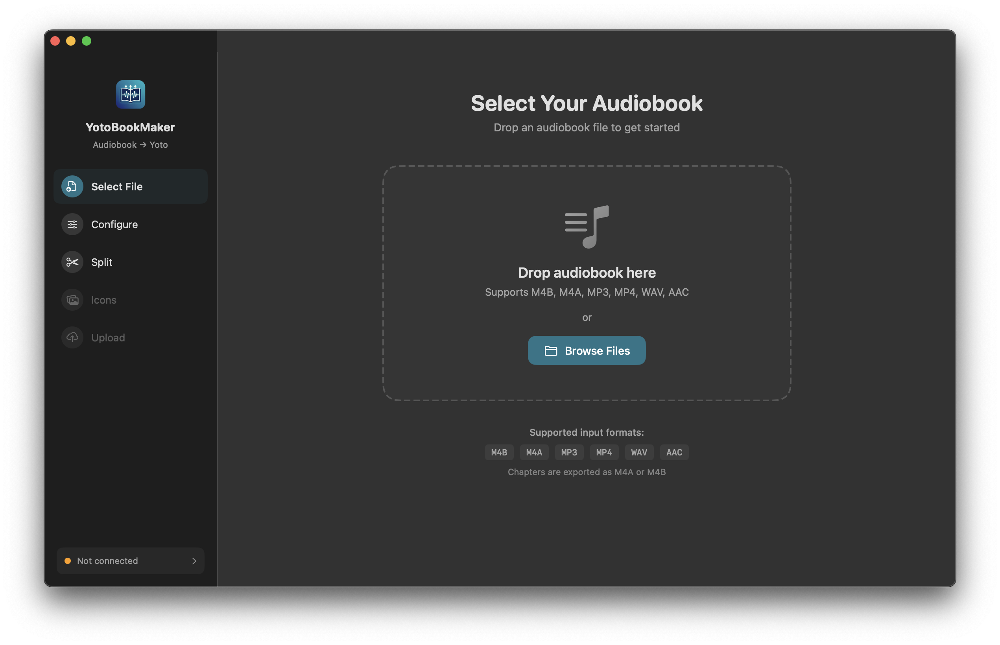
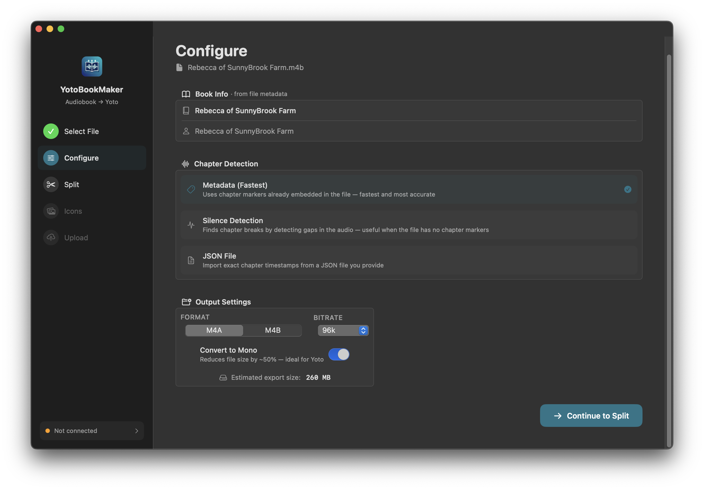
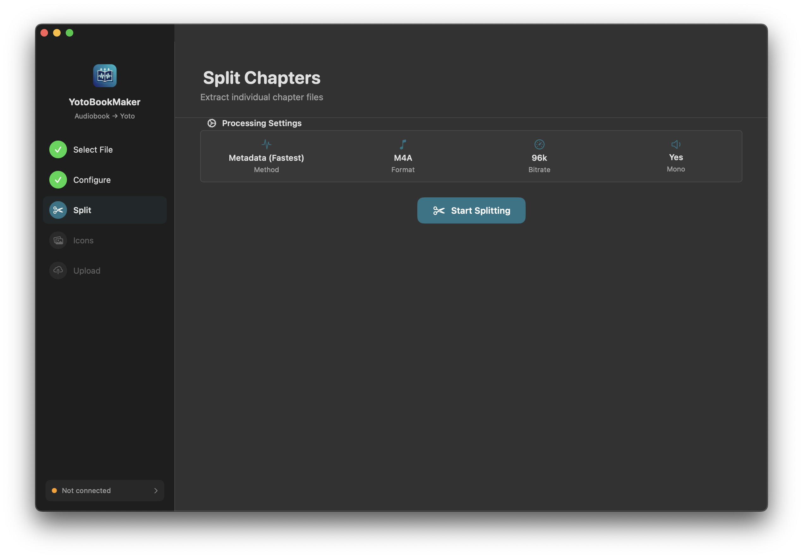
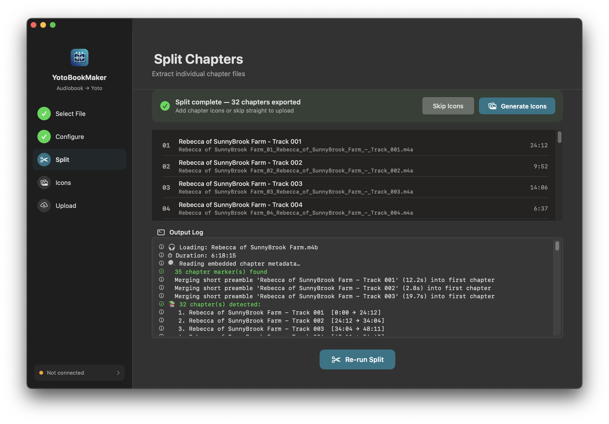
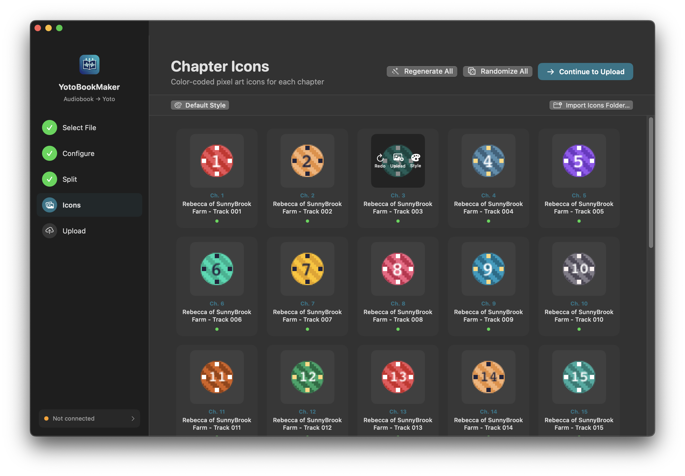
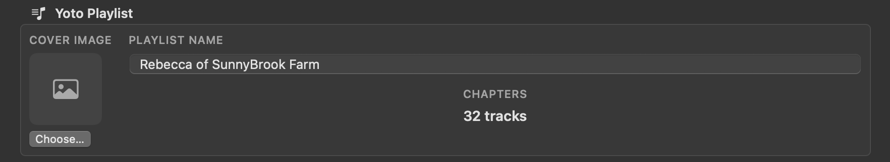
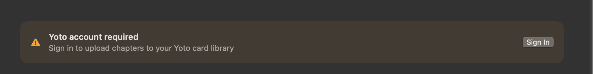
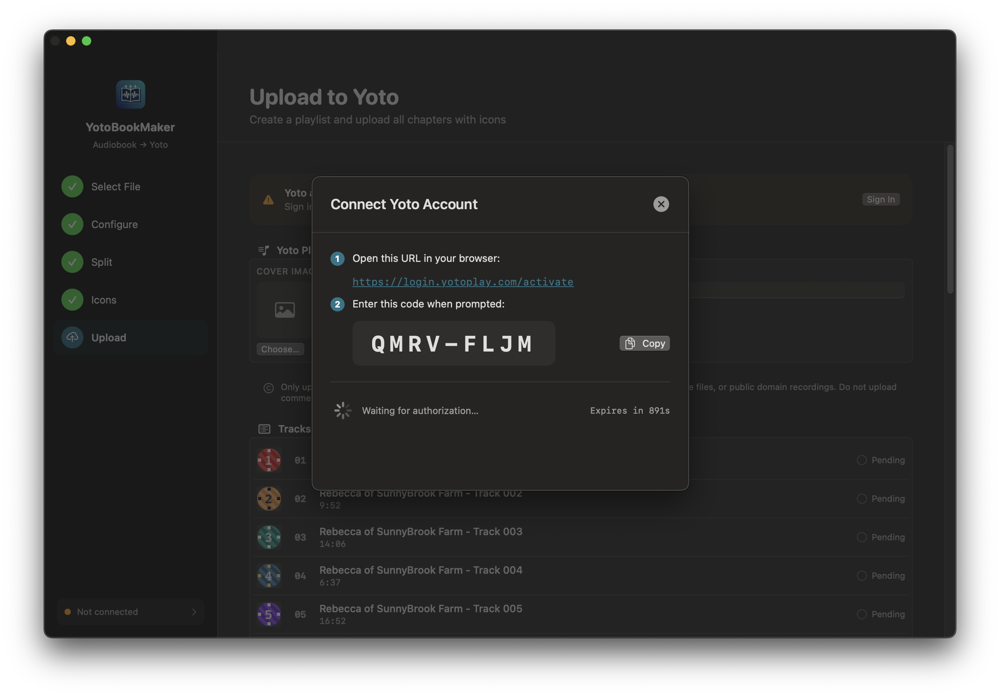
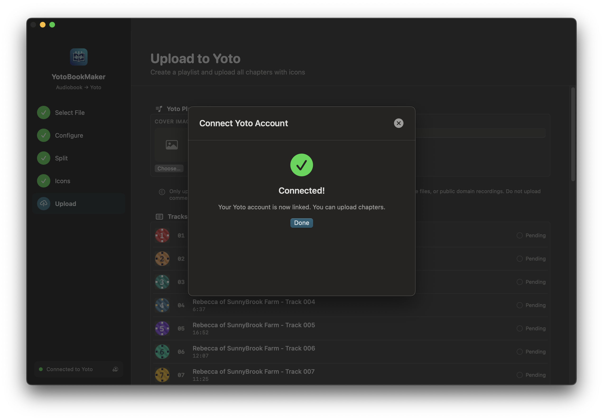
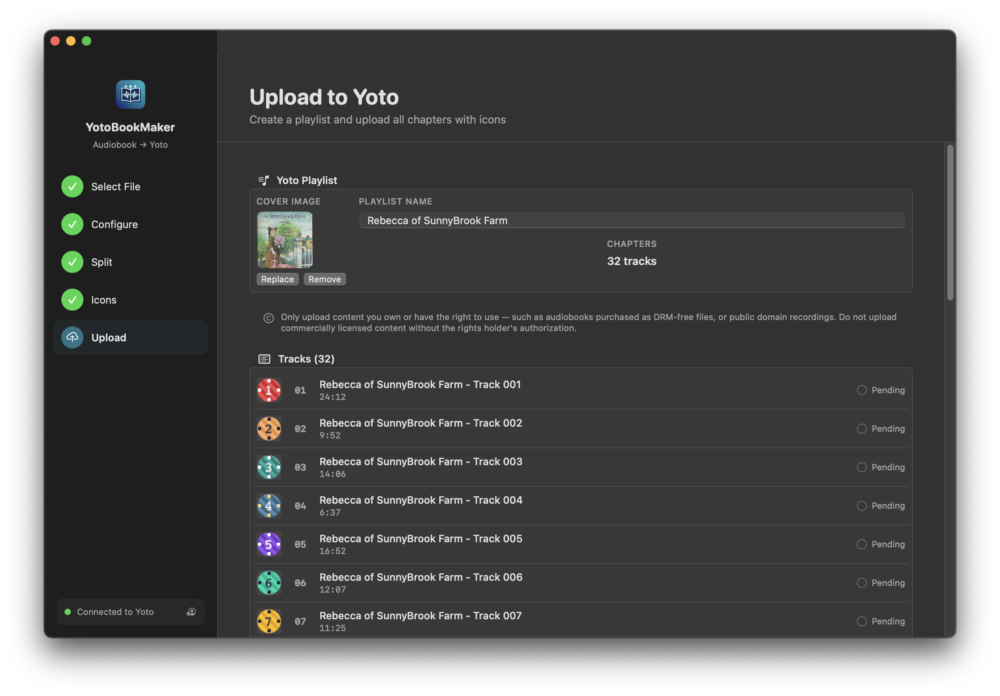

# YotoBookMaker

A native macOS app for getting audio onto your [Yoto](https://yotoplay.com) player — split an audiobook into chapters, or upload a folder of audio files directly as a playlist.

> **Independent tool — not affiliated with or endorsed by Yoto Limited.**

 

Also available for **[Windows →](https://github.com/bbenkle/YotoBookMaker-Windows)**

---

## Download

Grab the latest release from the [Releases](../../releases) page, open the `.dmg`, and drag **YotoBookMaker** to your Applications folder.

---

## What it does

YotoBookMaker supports three workflows:

**Audiobook workflow** — Load a single audiobook file, split it into chapters using embedded metadata, silence detection, or custom timestamps, add icons, and upload to Yoto in five guided steps. The upload step is optional — you can split without one.

**Batch split workflow** — Pick a folder of audiobooks and split every file at once using shared export settings. No icons, no upload — pure batch splitting with per-file status and a cover image exported alongside each set of chapters.

**Playlist workflow** — Pick a folder of audio files (music, narration, existing chapter files, or anything else), review and reorder the tracks, add icons, and upload directly to Yoto as a playlist. No splitting required.

---

## Requirements

- macOS 14 Sonoma or later
- A [Yoto account](https://my.yotoplay.com) (only needed if uploading — you can split without one)

---

## Audiobook workflow

### 1 — Select your audiobook

Drop an audiobook file onto the window or click **Browse Files**. The book title and author are read automatically from the file's embedded metadata.

**Supported formats:** M4B · M4A · MP3 · MP4 · WAV · AAC



---

### 2 — Configure

Choose how chapters should be detected and pick your export settings.

**Chapter detection methods:**

| Method | When to use |
|---|---|
| **Embedded Metadata** | Best choice — works with most M4B files from Audible, iTunes, Libro.fm, etc. Instant and accurate. |
| **Silence Detection** | For files with no chapter markers. Finds chapter breaks by analyzing gaps in the audio. Not suitable for full-cast productions or books with continuous background music. |
| **JSON Timestamps** | Provide a JSON file with exact start times if you need full manual control. |

**Export options:**

| Setting | Options |
|---|---|
| Format | M4A · M4B · WAV |
| Bitrate | **Original (no re-encode)** (default) · 32 · 48 · 64 · 96 · 128 · 192 kbps |
| Mono | On by default — recommended for Yoto. Auto-enabled and locked when 32 or 48 kbps is selected (Apple's AAC-LC encoder can't produce stereo at those rates). Your prior stereo/mono preference is restored when you pick a higher bitrate. |
| Create subfolder | On by default — creates a `<title>_chapters` folder in your chosen location. Turn off to save files directly in the chosen folder. |

**Yoto has a maximum upload size of 500 MB for Make Your Own Playlist.** Please use the size estimator to find the correct export settings for your book.

The estimated export size is shown before you split. When using **Original** quality, the size matches your source file exactly.

#### Silence detection sensitivity

When using silence detection, choose a sensitivity level that suits your recording:

| Level | Best for |
|---|---|
| **Low** | Expressive narrators with dramatic pauses — conservative, only fires on long quiet gaps (≥ 5s) |
| **Medium** | Most professionally produced audiobooks — balanced default |
| **High** | Recordings with slight background noise or music fades — more sensitive, may produce extra splits |

#### JSON Timestamps format

If you choose **JSON Timestamps**, browse to a `.json` file containing your chapter list. The file is validated immediately on selection — you'll see the chapter count (or a specific error) before you proceed.

Each entry needs a title and a start/end time:

```json
[
  { "title": "Opening Credits", "start": "0:00:00", "end": "0:05:42" },
  { "title": "Chapter 1",       "start": "0:05:42", "end": "0:38:17" },
  { "title": "Chapter 2",       "start": "0:38:17", "end": "1:11:04" }
]
```

Times use `H:MM:SS` or `M:SS` format. Milliseconds are also supported (`start_ms` / `end_ms`). An [example file](example-chapters.json) is included in the repository.

> **Tip:** if you've already split an audiobook using the Metadata method, the `_chapters.json` file it produces can be used directly as input for JSON detection on another file.



---

### 3 — Split

Click **Start Splitting**. A live log shows what's happening as each chapter is detected and exported, along with an elapsed timer. The chapter list stays on screen after splitting so you can review results, and you can re-run with different settings at any time.

A `<title>_chapters.json` file is written to the output folder automatically — it lists every chapter with its title, timestamps, and file path. This file can be used as JSON Timestamps input if you want to re-split the same book with different export settings.

If the source file contains embedded cover art, a `cover.jpg` is written to the output folder alongside the chapter files.

Once splitting is complete, a **Move Original to Trash** button appears in the results banner if you want to clean up the source file.

> **DRM-protected files:** YotoBookMaker only works with DRM-free audio. Files protected by FairPlay or other DRM are detected automatically and rejected with a clear error — only DRM-free purchases, rips from your own CDs, or public domain recordings can be split.





---

### 4 — Icons

Each chapter gets a color-coded pixel art icon, generated entirely on your Mac — no internet needed.

- **Generate All** — auto-generate icons for every chapter
- **Randomize All** — give every chapter a unique random color scheme
- **Per-chapter customization** — hover any chapter card to generate, redo, upload your own image, or customize the colors and pattern
- **Bulk import** — choose a folder of images and they'll be matched to chapters by number in the filename (e.g. `ch-01.png`, `Chapter 22.jpeg`)



---

### 5 — Upload



Sign in to your Yoto account — no password is entered into the app; you approve access in your browser. Then click **Upload to Yoto** and the app handles the rest: uploading audio, icons, and creating a ready-to-play playlist on your card.

Your sign-in is saved securely in the macOS Keychain so you only need to do it once.






---

## Playlist workflow

Click **Choose Folder** in the "Upload audio files" section on the welcome screen. Pick any folder of audio files — music, narration, existing chapter splits, or any other content.

Track titles are read from each file's embedded metadata and fall back to the filename if none is found.

### 1 — Playlist Setup

Review the track list loaded from your folder. You can:

- **Edit track titles** — click any title to change it
- **Reorder tracks** — drag rows into the order you want
- **Remove a single track** — hover the row and click the × button that appears, or select it and press Delete
- **Remove multiple tracks** — click to select, then Shift-click or Command-click to extend the selection, then press Delete or click the **Remove N Tracks** button in the toolbar
- **Add more files** — click **Add Files…** to include audio files from other locations
- **Set the playlist name** — used as the title when uploading to Yoto

### 2 — Icons

Same icon step as the audiobook workflow — generate pixel art icons per track, customize colors and patterns, or import your own images.

### 3 — Upload

Sign in to Yoto and click **Upload to Yoto**. The app uploads each track's audio and icon, then creates a ready-to-play playlist on your card.

---

## Batch split workflow

Click **Choose Folder** in the "Split a folder of audiobooks" section on the welcome screen. Pick any folder containing M4B, M4A, MP3, or other audio files — every file in the folder will be split using its embedded chapter metadata.

### 1 — Configure

Set shared export settings that apply to every file in the folder:

- **Format** — M4A or M4B
- **Bitrate** — Original (no re-encode) or a specific kbps target
- **Mono** — convert to mono (recommended for Yoto). Auto-enabled and locked when 32 or 48 kbps is selected; your prior stereo/mono preference is restored when you pick a higher bitrate.
- **Search subfolders** — off by default. Turn on to recursively scan nested folders, useful for collections organized as one folder per book (e.g. `Author/Series/Book Title/audio.m4b`). The app's own `*_chapters` output folders are automatically skipped so previously-split books aren't picked up on a rescan.

Chapter detection is always **Embedded Metadata** in batch mode — the fastest and most reliable method. Silence detection and JSON timestamps require per-file configuration and are not available for batch runs.

Each book's chapters are saved in a `<title>_chapters/` subfolder next to the source file. If a book has embedded cover art, a `cover.jpg` is written into that subfolder as well.

### 2 — Batch Split

A list shows every audiobook with a live status indicator:

- **Queued** — waiting to be processed
- **Splitting** — currently processing, with a per-file progress bar
- **Done** — split successfully, with the chapter count
- **Failed** — an error occurred (message shown inline)

Files are processed one at a time in alphabetical order. A **Cancel** button stops the batch after the current file finishes. When the run is complete, a summary shows how many books succeeded and how many failed, with a **Split Another Folder** button to start over.

---

## CLI tool (yotosplit)

YotoBookMaker includes a command-line tool for splitting audiobooks from scripts or automation pipelines — no UI needed.

**Install once** via **Help → Install CLI Tool…** in the app, then use it from any terminal:

```bash
# Split a single file using embedded chapter metadata (default)
yotosplit --input ~/audiobooks/Book.m4b

# Silence detection with custom threshold
yotosplit --input ~/audiobooks/Book.m4b --method silence --min-silence 2.5

# Re-encode to 64 kbps mono, save directly in the output folder
yotosplit --input ~/audiobooks/Book.m4b --output ~/Desktop/chapters --bitrate 64k

# Move the original to Trash after a successful split
yotosplit --input ~/audiobooks/Book.m4b --trash

# Split every audiobook in a folder (embedded metadata, shared settings)
yotosplit --folder ~/audiobooks --bitrate 64k --mono
```

Chapter list is printed to stdout (tab-separated: number, title, path) — easy to pipe into other tools. In folder mode, each line is prefixed with the source filename: `<filename>\t<number>\t<title>\t<path>`. Progress and log messages go to stderr. Exit code 0 on success, 1 on error.

A `<title>_chapters.json` file is always written to the output directory alongside the audio files. If the source file contains embedded cover art, a `cover.jpg` is written there as well.

```
USAGE: yotosplit (--input <file> | --folder <path>)
                 [--output <output>] [--method <method>]
                 [--format <format>] [--bitrate <bitrate>]
                 [--mono] [--no-mono]
                 [--silence-threshold <dBFS>] [--min-silence <seconds>]
                 [--json-file <path>] [--trash]
```

`--folder` is mutually exclusive with `--input`. In folder mode, `--method` is ignored — embedded metadata is always used.

Run `yotosplit --help` for full option descriptions.

---

## Updates

The app checks for new releases automatically on launch. When an update is available, a badge appears in the sidebar with a link to the release page.

---

## Privacy

| | |
|---|---|
| Audio splitting | Stays entirely on your Mac |
| Icon generation | Stays entirely on your Mac |
| Speech recognition (used during silence detection) | On-device. Only falls back to Apple's servers if the on-device model is unavailable — this is logged if it happens |
| Update check | Sends a read-only request to the GitHub Releases API — no personal data |
| Upload | Sent to Yoto's servers — only when you click Upload |

No analytics. No telemetry. No third-party services.

---

## Disclaimer

YotoBookMaker is an independent, community-built tool. It is **not affiliated with, endorsed by, or supported by Yoto Limited**. Yoto, the Yoto logo, and Yoto Player are trademarks of Yoto Limited.

Only upload audio content you own or have the legal right to use — such as DRM-free audiobook purchases or public domain recordings. Do not upload commercially licensed content without the rights holder's authorization.

---

## License

MIT — see [LICENSE](LICENSE) for details.
